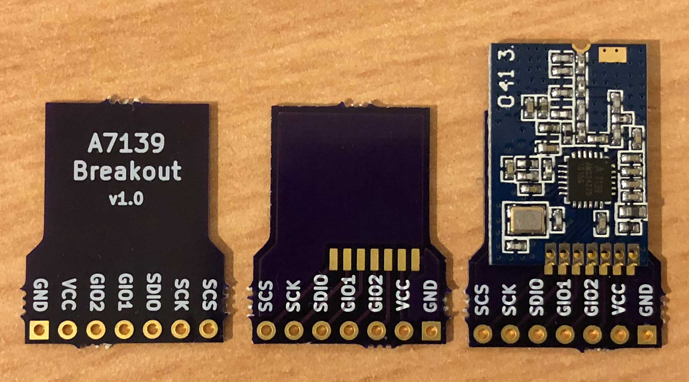
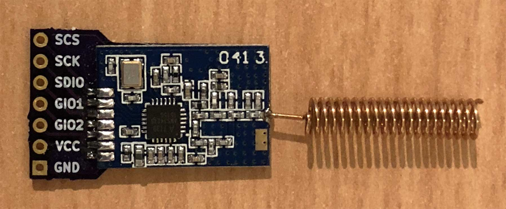
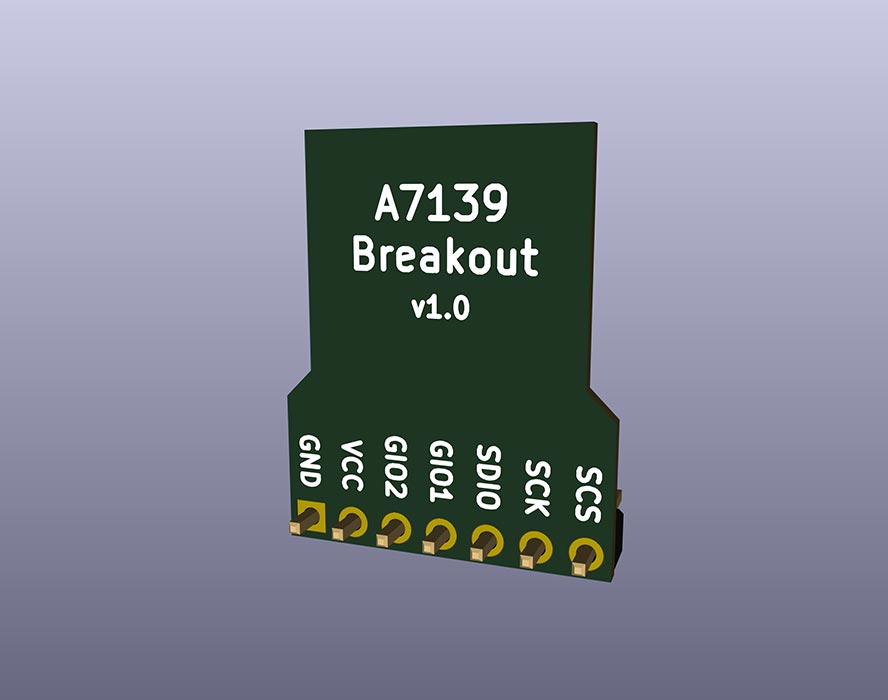
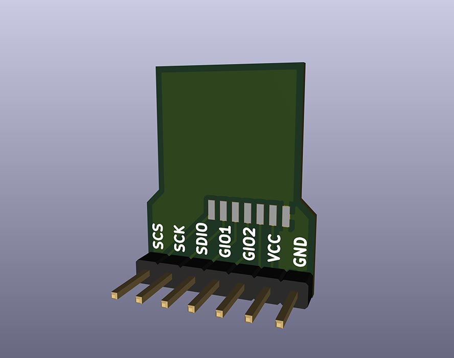
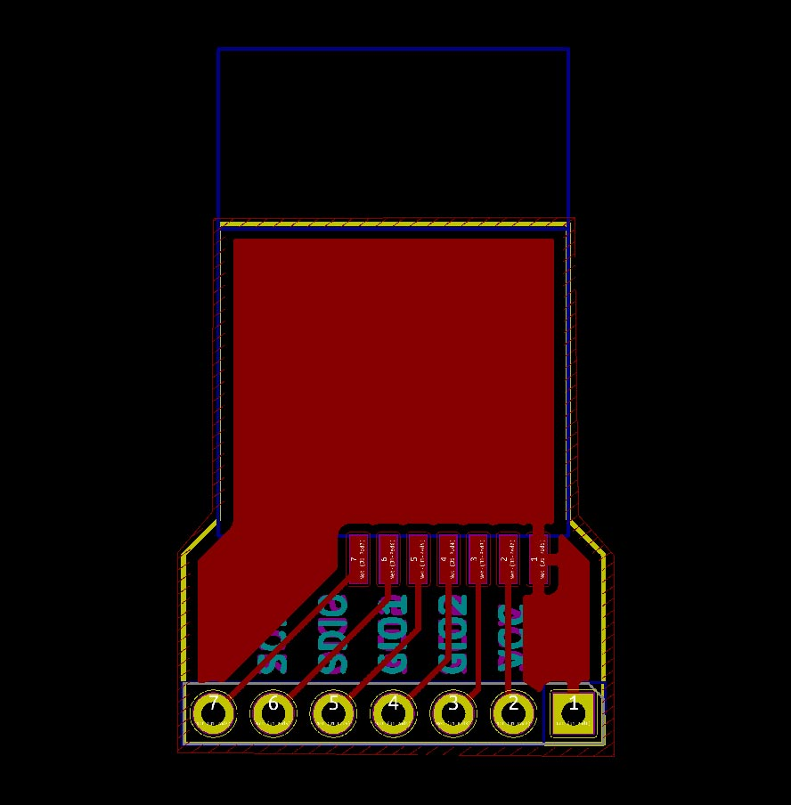
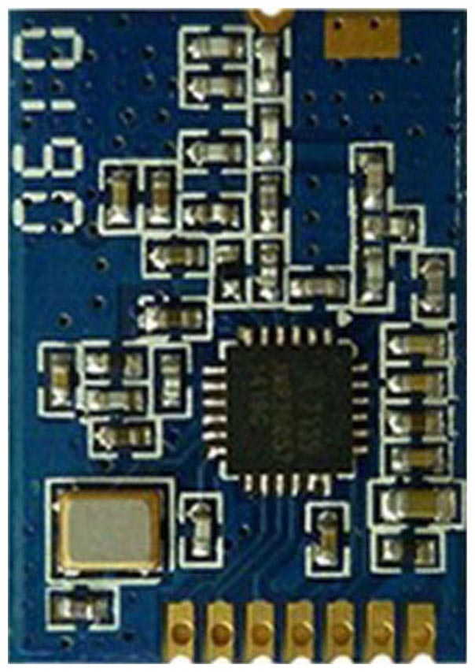
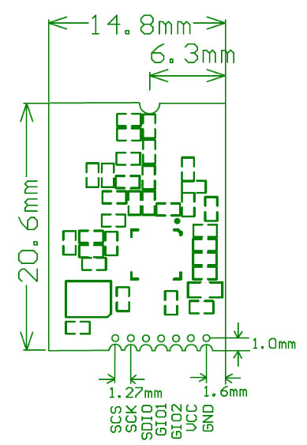

# A7139 Breakout

Breakout board for the [AMICCOM A7139 433MHz RF transceiver module](https://www.aliexpress.com/item/A7139-wireless-module-A7108-A7105-A7125/32817644212.html).

Order the board from OSH Park here: <https://oshpark.com/shared_projects/94JruTP3>

3x boards for $3.05 (2 oz copper, 0.8mm thickness)

Only component you need is 1x7 straight or right-angle 2.54mm headers.

Designed using [KiCad 5](http://kicad.org/).

# OSH Park Purple PCBs

# Models

# PCB

# A7139 module

# Links

* [A7139 433MHz RF transceiver module](https://www.aliexpress.com/item/A7139-wireless-module-A7108-A7105-A7125/32817644212.html)
* [A7139 RF transceiver chip](http://www.amiccom.com.tw/asp/product_detail.asp?CATG_ID=1&PRODUCT_ID=80)
* [Order the board on OSH Park](https://oshpark.com/shared_projects/94JruTP3)

# License

Licensed under the [MIT License](http://opensource.org/licenses/MIT).
